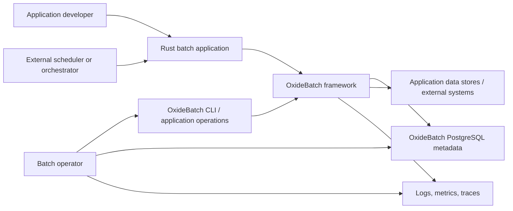

# System Context and Deployment Boundaries

**State:** Accepted

**Proposed extension:** Distributed execution depends on RFC-0009.

## Context

OxideBatch is an embedded framework plus optional operator tooling. An external
scheduler decides when a process starts. The framework decides execution
identity, lifecycle, checkpoint, and restart behavior. It is not itself a
cluster scheduler or control-plane service.

The current deployment archetypes below describe M1-M5 embedded scope.
[Distributed execution](distributed-execution.md) is a proposed M11
architecture under RFC-0009. The external
[control-plane boundary](../operations/control-plane-boundary.md) is accepted
by RFC-0008. Neither turns the core into a scheduler or hosted service.

## Initial deployable units

| Unit | Owner | Responsibility |
| --- | --- | --- |
| Batch application/worker | Application team | Job definitions, business components, runtime assembly |
| OxideBatch libraries | Project | Domain/runtime/repository behavior |
| PostgreSQL metadata schema | Project schema; deployment-operated | Durable identity, state, context, locks |
| Business resources | Application team | Business data and external effect semantics |
| Operator CLI | Project binary/application-integrated | Inspect and request guarded operations |
| Telemetry backend | Deployment | Store/query exported diagnostics |
| External scheduler | Deployment | Trigger process and apply scheduling policy |

## Trust and correctness boundaries

- The application is trusted native code in the same process; OxideBatch is not
  a sandbox.
- PostgreSQL is the durable authority for framework state.
- Business systems are separate resources unless an adapter proves transaction
  enlistment.
- Telemetry and scheduler state may be stale and cannot override the repository.
- CLI authorization is provided by OS/database/deployment controls unless a
  future service adds authentication.

## Supported initial deployment archetypes

### One-shot process

The scheduler starts a process for one job execution. Process exit code reports
the operator result. This is the simplest and primary initial archetype.

### Resident worker

A long-lived process accepts launch requests from application-owned code.
Resource isolation, shutdown, stale work, and configuration reload need
additional contracts; no first-party network API is implied.

### Containerized job

A one-shot process runs in a container with external secrets, PostgreSQL, and
telemetry. Orchestrator retry must not create a new business instance unless
identifying parameters change.

## Permanently absent from the embedded core

- OxideBatch-hosted SaaS/control plane;
- built-in cron or dependency scheduler;
- hostile job-code sandbox;
- shared live Spring Batch metadata tables;
- automatic distributed transaction coordinator.

Cross-host worker coordination is currently absent and proposed for M11 behind
a versioned protocol. Hostile code isolation, if added, uses an explicit WASI
profile rather than changing the trust model for native Rust job code.
